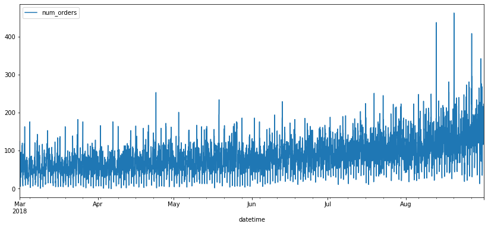
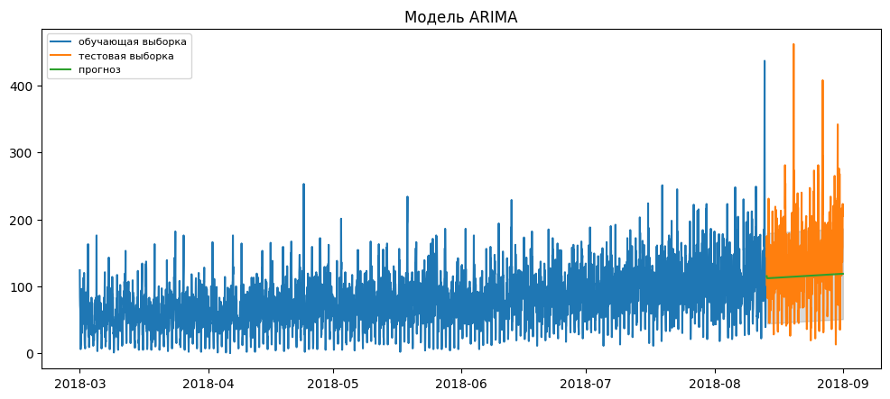
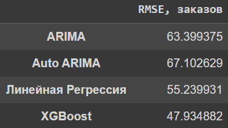
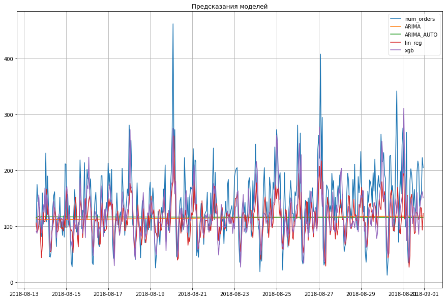

# Предсказание количества заказов такси

В проекте построены модель для предсказания количества заказов такси на следующий час для компании "Четенькое такси".  

Проект сделан на основе временных рядов. В качестве исходных данных используются исторические данные о заказах такси в аэропортах.  

Метрикой качества является RMSE (root mean squared error), который не должен быть больше 48 на тестовой выборке.  

Задачи проекта:
* Загрузить данные и выполнить их ресемплирование по одному часу.
* Проанализировать данные.
* Обучить разные модели с различными гиперпараметрами. Сделать тестовую выборку размером 10% от исходных данных.
* Проверить данные на тестовой выборке и сделать выводы.

# Выполнение проекта
Проведен тест Харки — Бера для определения нормальности распределения.  

Выявлена сезонность во временном ряду данных.  

Согласно тесту Дики — Фуллера ряд не является стационарным, сделаны поправки на наличие тренда при обучении модели предсказания.  

В проекте сравниваются предсказания четырех моделей: `ARIMA`, `Auto Arima`, `Auto Arima-2`, `Линейная регрессия`, `XGBoost`.  

# Визуализация исторических данных   
  

# Пример предсказания модели ARIMA 
  

# Сравнение моделей
  
  

# Вывод
В результате выполнения проекта были построены четыре модели предсказания заказов такси в аэропорта компании "Чётенькое такси".  

Единственной моделью со значением метрики RMSE ниже 48 является модель XGBoost. Данная модель имеет множество гиперпараметров для более точной настройки, поэтому ее рекомендуется использовать для предсказания заказов.
